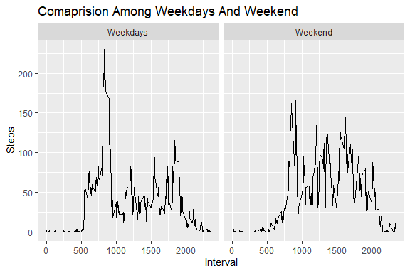

## 1. Data Loading And Required Transformation.

```r
data<-read.csv("activity.csv")
data$date<-parse_date_time(data$date,"ymd")
```
## 2. Calculation for plotting of Histogram.

```r
df<-group_by(data,date)%>%summarise(steps=sum(steps,na.rm = TRUE))
```

```
## `summarise()` ungrouping output (override with `.groups` argument)
```

```r
g<-ggplot(df,aes(steps,fill="count"))
g+geom_histogram(bins  = 20)+ggtitle("Histogram for Total no of steps summed over days")+xlab("Steps")+theme_light()
```

<!-- -->

## 3. Mean and median number of steps taken each day.

```r
#Median 
md<-median(df$steps,na.rm = TRUE)
md
```

```
## [1] 10395
```

```r
#Mean
mn<-mean(df$steps,na.rm = TRUE)
mn
```

```
## [1] 9354.23
```
## 4. Time series plot of the average number of steps taken.

```r
tf<-group_by(data,interval)%>%summarise(steps=mean(steps,na.rm = TRUE))
```

```
## `summarise()` ungrouping output (override with `.groups` argument)
```

```r
tm<-ggplot(tf,aes(interval,steps))
tm+geom_line(lwd=0.5,color="black")+theme_light()+ggtitle(" No Of Steps Averaged Over Days For Different Intervals. ")+xlab("Interval")+ylab("Steps")
```

<!-- -->

## 5. The 5-minute interval that, on average, contains the maximum number of steps.

```r
tf[which(tf$steps==max(tf$steps)),]
```

```
## # A tibble: 1 x 2
##   interval steps
##      <int> <dbl>
## 1      835  206.
```
## 6. Code to describe and show a strategy for imputing missing data
The missing values for a particular interval is replaced by the mean of that interval.

```r
missing_activity<-data[is.na(data$steps),]
nonMissing_activity<-data[!is.na(data$steps),]
impu_activity<-left_join(missing_activity,tf,by="interval")%>%select(-steps.x)%>%rename(steps=steps.y)
cor_data<-rbind(nonMissing_activity,impu_activity)
```
## 7. Histogram of the total number of steps taken each day after missing values are imputed

```r
df1<-group_by(cor_data,date)%>%summarise(steps=sum(steps))
```

```
## `summarise()` ungrouping output (override with `.groups` argument)
```

```r
 g_cor<-ggplot(df1,aes(steps,fill="count"))
 g_cor+geom_histogram(bins = 20)+ggtitle("Histogram of the total no of steps taken after data Imputation. ")+xlab("Steps")+ylab("count")
```

<!-- -->

## Panel plot comparing the average number of steps taken per 5-minute interval across weekdays and weekends

```r
#transformin the data 
z<-function(x){if(x==1|x==7){1} else {0}}
f<-sapply(wday(cor_data$date),z)
wd<-mutate(cor_data,weekdays=as.factor(f))
wd<-group_by(wd,interval,weekdays)%>% summarise(steps=mean(steps))
```

```
## `summarise()` regrouping output by 'interval' (override with `.groups` argument)
```

```r
class(wd$weekdays)
```

```
## [1] "factor"
```

```r
levels(wd$weekdays)<-c("Weekdays","Weekend")
g<-ggplot(wd,aes(interval,steps))
g+geom_line()+facet_wrap(~weekdays)+ggtitle("Comaprision Among Weekdays And Weekend")+xlab("Interval")+ylab("Steps")
```

<!-- -->

```r
table(f)
```

```
## f
##     0     1 
## 12960  4608
```

```r
#weekdays are coded as 0 and weekend as 1
```


